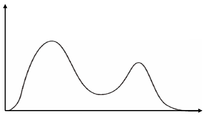
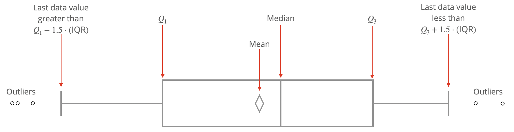

# Introduction to Statistics {#intro-stat}

Welcome to your introduction to statistics.  You will be learning the basics of statistics, along with applications of statistics within the Python and R languages.  This book will provide fundamentals of the concepts and the code to apply these concepts in both languages. \  


This Chapter aims to answer the following questions:

* What type of data is being analyzed?   
  + Nominal 
  + Ordinal
  + Continuous/Discrete
* How do we describe distributions of these variables?
  + Center 
  + Spread
  + Shape
  + Graphical Display
* How do we create confidence intervals for parameters?
* How do we perform hypothesis testing?
  + One sample t-test 
  + Two sample t-test
  + Testing Normality
  + Testing Equality of Variances
  + Testing Equality of Means
  + Mann-Whitney-Wilcoxon Test


The following packages will be used in this textbook (there are some sections that add more later in the textbook, so keep your eyes open for those). 


Installing packages:  


```{r, echo=FALSE, message=FALSE}
library(reticulate)
#use_python("C:\\Users\\sjsimmo2\\AppData\\Local\\Programs\\Python/Python39\\python.exe")
use_python("C:\\ProgramData\\Anaconda3\\python.exe")
```

#### R code:

```{r eval=F, message=F,warning=FALSE}
install.packages('AmesHousing')
install.packages('tidyverse')
install.packages('car')
install.packages('DescTools')
install.packages('corrplot')
install.packages('mosaic')
install.packages('modelr')
install.packages('plotly')
install.packages('ggplot2')
install.packages('Hmisc')
install.packages('onehot')
install.packages('jmuOutlier')
install.packages('leaps')
install.packages('glmnet')
install.packages('nortest')
install.packages('lmtest')
install.packages('gmodels')
install.packages('TSA')
install.packages('carData')


```


```{r}
## This brings in the Ames housing data
library(AmesHousing)
ames <- make_ordinal_ames() 
str(ames)
```

#### Python Code:

```{python}

import pandas as pd
import numpy as np
from sklearn.preprocessing import OneHotEncoder
import seaborn as sns
import matplotlib.pyplot as plt
from numpy import random
import statsmodels.api as sma
import statsmodels as sm
import pylab as py
import scipy.stats as stats
import scipy as sp
import statsmodels.formula.api as smf
import sklearn
from sklearn.linear_model import Ridge
from sklearn.linear_model import Lasso
from sklearn.linear_model import ElasticNet
from sklearn.metrics import mean_squared_error
from plotnine import *

## This brings in the Ames housing data

ames_py = pd.read_csv('https://raw.githubusercontent.com/IAA-Faculty/statistical_foundations/refs/heads/master/Ames.csv')

ames_py
```


## Exploratory Data Analysis (EDA) {#eda}

The crucial first step to any data science problem is exploratory data analysis (EDA). Before you attempt to run any models, or jump towards any formal statistical analysis, you must ___explore your data___. Many unexpected frustrations arise when exploratory analysis is overlooked; knowing your data is critical to your ability to make necessary assumptions about it and analyzing it appropriately. This preliminary analysis will help inform our decisions for data manipulation, give us a base-level understanding of our variables and the relationships between them, and help determine which statistical analyses might be appropriate for the questions we are trying to answer. Some of the questions we aim to answer through exploratory analysis are:

* What kind of variables do you have? 
  + Continuous
  + Nominal
  + Ordinal
* How are the attributes stored?
  + Strings
  + Integers
  + Floats/Numeric
  + Dates
* What do their distributions look like?
  + Center/Location
  + Spread
  + Shape
* Are there any anomolies?
  + Outliers
  + Leverage points
  + Missing values
  + Low-frequency categories  
  


 Throughout the textbook, we will continue to use a real-estate data set that contains the `sale_price` and numerous physical attributes of nearly 3,000 homes in Ames, Iowa in the early 2000s. The chunks above provide the code to import the Ames housing data into both Python and R.


### Types of Variables {#vartypes}

The columns of a data set are referred to by the following __equivalent terms__:


* Variables
* Features
* Attributes
* Predictors/Targets
* Factors
* Inputs/Outputs  


This book may use any of these words interchangeably to refer to a quality or quantity of interest in our data. 

### Nominal Variables 

A __nominal__ or __categorical variable__ is a _quality of interest_ whose values have no logical ordering.  Color ("blue", "red", "green"...), ethnicity ("African-American", "Asian", "Caucasian",...), and style of house ("ranch", "two-story", "duplex", ...) are all examples of nominal attributes. The categories or values that these variables can take on - those words listed in quotes and parenthesis - are called the __levels__ of the variable. 

In modeling, nominal attributes are commonly transformed into __dummy variables__. Dummy variables are binary columns that indicate the presence or absence of a quality. There is more than one way to create dummy variables, and the treatment/estimates will be different depending on what type of model you are using. Linear regression models will use either __reference-level__ or __effects coding__, whereas other machine learning models are more likely to use one-hot encoding or a variation thereof. 

__One-hot encoding__

For machine learning applications, it is common to create a binary dummy column for each level of your categorical variable. This is the most intuitive representation of categorical information, answering indicative questions for each level of the variable: _"is it blue?"_, _"is it red?"_ etc. The table below gives an example of some data, the original nominal variable (color) and the one-hot encoded color information. 

<table>
<tr>
<td> Observation<td> Color<td> Blue<td> Red<td> Yellow<td> Other
<tr><td> 1<td> Blue<td> 1<td> 0<td> 0<td> 0
<tr> <td> 2<td> Yellow<td> 0<td> 0<td> 1<td> 0
<tr><td> 3<td> Blue<td> 1<td> 0<td> 0<td> 0
<tr><td> 4<td> Red<td> 0<td> 1<td> 0<td> 0
<tr><td> 5<td> Red<td> 0<td> 1<td> 0<td> 0
<tr><td> 6<td> Blue<td> 1<td> 0<td> 0<td> 0
<tr> <td> 7<td> Yellow<td> 0<td> 0<td> 1<td> 0
<tr><td> 8<td> Other<td> 0<td> 0<td> 0<td> 1
</table>
<caption> (\#tab:onehot)One-hot dummy variable coding for the categorical attribute _color_ </caption>  


We will demonstrate the creation of this data using some simple random categorical data:

```{r}
set.seed(41)
dat <- data.frame(y = c(rnorm(10,2), rnorm(10,1),rnorm(10,0)),
                x1 = factor(rep(c("A", "B", "C"), each = 10)),
                x2 = factor(rep(c("Z", "X", "Y","W","V","U"), each = 5)))
print(dat)
```


Unlike reference and effects coding, which are used in linear regression models, one-hot encoding is most quickly achieved through use of the `onehot` package in R, which first creates an "encoder" to do the job quickly. 

The speed of this function has been tested against both the base R `model.matrix()` function and the `dummyVars()` function in the `caret` package and is _substantially_ faster than either. 

#### R code:

You will need to bring the packages into your currently opened R session (this will need to be done whenever you open a new session):

```{r message=F}
library(AmesHousing)
library(tidyverse)
library(car)
library(DescTools)
library(corrplot)
library(mosaic)
library(modelr)
library(plotly)
library(ggplot2)
library(Hmisc)
library(onehot)
library(jmuOutlier)
library(leaps)
library(glmnet)
library(nortest)
library(lmtest)
library(gmodels)
library(TSA)
library(carData)


```

To create one-hot encoding in R:

```{r message=FALSE}
library(onehot)

encoder  = onehot(dat)
dummies = predict(encoder,dat)
head(dummies)
```


#### Python Code


For one-hot encoding in Python:

```{python}

x1=np.repeat(["A","B","C"],10)
x2=np.repeat(["Z", "X", "Y","W","V","U"],5)
random.seed(41)
y=np.concatenate([np.random.normal(loc=2.0, scale=1.0, size=10),np.random.normal(loc=1.0, scale=1.0, size=10),np.random.normal(loc=0.0, scale=1.0, size=10)])
array=np.array([x1,x2,y])
array2=np.transpose(array)
column_values=["x1","x2","y"]
df = pd.DataFrame(data = array2, 
                  columns = column_values)
print(df)
one_hot_encoded_data = pd.get_dummies(df, columns = ['x1', 'x2'],dtype=int)
print(one_hot_encoded_data)
```

__Reference-level coding __

Reference-level coding is similar to one-hot encoding except one of the levels of the attribute, called the __reference level__, is omitted. Notice that the 4 dummy columns from Table \@ref(tab:onehot) collectively form a linearly dependent set; that is, if you know the values of 3 of the 4 dummy variables you can determine the $4^{th}$ with complete certainty. This would be a problem for linear regression, where we assume our input attributes are not linearly dependent as we will discuss when we get to Simple Linear Regression.  

A reference level of the attribute is often specified by the user to be a particular level worthy of comparison (a baseline), as the estimates in the regression output will be interpreted in a way that compares each non-reference level to the reference level. If a reference level is not specified by the user, one will be picked by the software by default either using the order in which the levels were encountered in the data, or their alphabetical ordering. Users should check the documentation of the associated function to understand what to expect.

Table \@ref(tab:refcoding) transforms the one-hot encoding from Table \@ref(tab:onehot) into reference-level coding with the color "blue" as the reference level. Notice the absence of the column indicating "blue" and how each blue observation exists as a row of zeros.  


<table>
<tr><td> Observation<td> Color<td> Red<td> Yellow<td> Other</tr>
<tr><td> 1<td> Blue<td> 0<td> 0<td> 0</tr>
<tr><td> 2<td> Yellow<td> 0<td> 1<td> 0</tr>
<tr><td> 3<td> Blue<td> 0<td> 0<td> 0</tr>
<tr><td> 4<td> Red<td> 1<td> 0<td> 0</tr>
<tr><td> 5<td> Red<td> 1<td> 0<td> 0</tr>
<tr><td> 6<td> Blue<td> 0<td> 0<td> 0</tr>
<tr><td> 7<td> Yellow<td> 0<td> 1<td> 0</tr>
<tr><td> 8<td> Other<td> 0<td> 0<td> 1</tr>
</table>
<caption> (\#tab:refcoding) Reference-level dummy variable coding for the categorical attribute _color_ and the reference level of "blue" </caption>  


__Effects coding__

Effects coding is useful for obtaining a more general comparative interpretation when you have approximately equal sample sizes across each level of your categorical attribute. Effects coding is designed to allow the user to compare each level to _all_ of the other levels. More specifically the mean of each level is compared to the __overall mean__ of your data. However, the comparison is actually to the so-called _grand mean_, which is the mean of the means of each group. When sample sizes are equal, the grand mean and the overall sample mean are equivalent. When sample sizes are _not_ equal, the parameter estimates for effects coding should not be used for interpretation or explanation. 

Effects coding still requires a _reference level_, however the purpose of the reference level is not the same as it was in reference-level coding. Here, the reference level is left out in the sense that no comparison is made between it and the overall mean. Table \@ref(tab:effcoding) shows our same example with effects coding. Again we notice the absence of the column indicating "blue"  but now the reference level receives values of `-1` rather than `0` for all 3 dummy columns.  We will revisit the interpretation of linear regression coefficients under this coding scheme in the Simple Linear Regression Section.  


<table>
<tr><td> Observation<td> Color<td> Red<td> Yellow<td> Other
<tr><td> 1<td> Blue<td> -1<td> -1<td> -1
<tr> <td> 2<td> Yellow<td> 0<td> 1<td> 0
<tr><td> 3<td> Blue<td> -1<td> -1<td> -1
<tr><td> 4<td> Red<td> 1<td> 0<td> 0
<tr><td> 5<td> Red<td> 1<td> 0<td> 0
<tr><td> 6<td> Blue<td> -1<td> -1<td> -1
<tr> <td> 7<td> Yellow<td> 0<td> 1<td> 0
<tr><td> 8<td> Other<td> 0<td> 0<td> 1
</table>
<caption> (\#tab:effcoding) Effects coding for the categorical attribute _color_ and the reference level of "blue" </caption>  


### Interval Variables

An interval variable is a _quantity of interest_ on which the mathematical operations of addition, subtraction, multiplication and division can be performed. Time, temperature and age are all examples of interval attributes. To illustrate the definition, note that "15 minutes" divided by "5 minutes" is 3, which indicates that 15 minutes is 3 times as long as 5 minutes. The sensible interpretation of this simple arithmetic sentence demonstrates the nature of interval attributes. One should note that such arithmetic would not make sense in the treatment of nominal variables. 

### Ordinal Variables 

__Ordinal variables__ are attributes that are qualitative in nature but have some natural ordering. _Level of education_ is a common example, with a level of 'PhD' indicating _more_ education than 'Bachelors' but lacking a numerical framework to quantify _how much more_. The treatment of ordinal variables will depend on the application. Survey responses on a Likert scale are also ordinal - a response of 4="somewhat agree" on a 1-to-5 scale of agreement cannot reliably be said to be twice as enthusiastic as a response of 2="somewhat disagree". These are not interval measurements, though they are often treated as such in a trade-off for computational efficiency. 

__Ordinal variables will either be given some numeric value and treated as interval variables or they will be treated as categorical variables and dummy variables will be created. The choice of solution is up to the analyst.__ When numeric values are assigned to ordinal variables, the possibilities are many. For example, consider _level of education_. The simplest ordinal treatment for such an attribute might be something like Table \@ref(tab:educationint).

<table>
<tr> <td> Level of Education <td> Numeric Value
<tr> <td> No H.S. Diploma <td> 1
<tr> <td> H.S. Diploma or GED <td> 2
<tr> <td> Associates or Certificate <td> 3
<tr> <td> Bachelors <td> 4
<tr> <td> Masters <td> 5
<tr> <td> PhD <td> 6
</table>
<caption> (\#tab:educationint) One potential approach to scaling the ordinal attribute level of education </caption>  


While numeric values have been assigned and this data and _could_ be used like an interval attribute, it's important to realize that the notion of a "one-unit increase" is qualitative in nature rather than quantitative. However, if we're interested in learning whether there is a _linear_ type of relationship between education and another attribute (meaning as education level increases, the value of another attribute increases or decreases), this would be the path to get us there. However we're making an assumption in this model that the difference between a H.S. Diploma and an Associates degree (a difference of "1 unit") is the same as the difference between a Master's degree and a PhD (also a difference of "1 unit"). These types of assumptions can be flawed, and it is often desirable to develop an alternative system of measurement based either on domain expertise or the target variable of interest. This is the notion behind __optimal scaling__ and __target-level encoding__.  


__Optimal Scaling__

The primary idea behind optimal scaling is to transform an ordinal attribute into an interval one in a way that doesn't restrict the numeric values to simply the integers $1,2,3, \dots$. It's reasonable for a data scientist to use domain expertise to develop an alternative scheme. 

For example, if analyzing movie theater concessions with ordinal drink sizes {small, medium, large}, one is not restricted to the numeric valuation of 1=small, 2=medium, and 3=large just because it's an ordinal variable with 3 levels. Perhaps it would make more sense to use the drink size in fluid ounces to represent the ordinality. If the small drink is 12 ounces, the medium is 20 ounces, and the large is 48 ounces, then using those values as the numerical representation would be every bit as (if not more) reasonable than using the standard integers 1, 2, and 3. 

If we re-consider the ordinal attribute level of education, we might decide to represent the approximate years of post-secondary  schooling required to obtain a given level. This might lead us to something like the attribute values in Table \@ref(tab:educationint2).

<table>
<tr> <td> Level of Education <td> Numeric Value
<tr> <td> No H.S. Diploma <td> 8
<tr> <td> H.S. Diploma or GED <td> 13
<tr> <td> Associates or Certificate <td> 15
<tr> <td> Bachelors <td> 17
<tr> <td> Masters <td> 19
<tr> <td> PhD <td> 22
</table>
<caption> (\#tab:educationint2) One potential approach to scaling the ordinal attribute level of education </caption>  


If we were modeling the effect of education on something like salary, it seems reasonable to assume that the jumps between levels should not have equal distance like they did in \@ref(tab:educationint). It seems reasonable to assume that one would experience a larger salary lift from Associate's to Bachelor's degree than they would from No H.S. Diploma to H.S Diploma. The most common way to determine the numeric values for categories is to use information from the response variable. This is commonly referred to as __target level encoding__.  


__Target Level Encoding__

The values in Table \@ref(tab:educationint2) might have struck the reader as logical but arbitrary. To be more scientific about the determination of those numeric values, one might wish to use information from the response variable to obtain a more precise expected change in salary for each level increase in education. At first hearing this, one might question the validity of the technique; isn't the goal to _predict_ salary? This line of thought is natural, which is why having a holdout sample is extremely important in this situation. To implement Target level encoding, we can simply create a look-up table that matches each level of education to the average or median salary obtained for that level. These values can be used just as readily as the arbitrary levels created in Table \@ref(tab:educationint2) to encode the ordinal attribute!


### Distributions 

After reviewing the types and formats of the data inputs, we move on to some basic __univariate__ (one variable at a time) analysis. We start by describing the distribution of values that each variable takes on. For nominal variables, this amounts to frequency tables and bar charts of how often each level of the variable appears in the data set.

We'll begin by exploring one of our nominal features, `Heating_QC` which categorizes the quality and condition of a home's heating system. To create plots in R, we will use the popular `ggplot2` library. At the same time, we will load the `tidyverse` library which we will use in the next chunk of code. 

#### R code:

```{r message=F,fig=T, fig.align='center', fig.cap = 'Distribution of Nominal Variable Heating_QC', label='barchart'}
library(ggplot2)
library(tidyverse)
ggplot(data = ames) +
  geom_bar(mapping = aes(x = Heating_QC),fill="orange") + labs(x="Heating System Quality",y="Frequency",title="Bar Graph of Heating System")
```


To summon the same information in tabular form, we can use the `count()` function to create a table:


```{r}
ames %>% 
  count(Heating_QC)
```


You'll notice that very few houses (3) have heating systems in `Poor` condition, and the majority of houses have systems rated `Excellent`. __It will likely make sense to combine the categories of `Fair` and `Poor` in our eventual analysis, a decision we will later revisit.__

Next we create a __histogram__ for an interval attribute like `Sale_Price`:

```{r message=F,label='histogram', fig.align='center', fig.cap = 'Distribution of Interval Variable Sale_Price'}
ggplot(data = ames) +
  geom_histogram(mapping = aes(x = Sale_Price/1000),fill="blue") + 
  labs(x = "Sales Price (Thousands $)",y="Frequency",title="Histogram of Sales Price in Thousands of Dollars")
```


From this initial inspection, we can conclude that most of the houses sell for less than $200,000 and there are a number of expensive anomalies. To more concretely describe and quantify a statistical distribution, we use statistics that describe the _location, spread, and shape_ of the data.

#### Python code:

Summary information for the the Ames data set:

```{python}

ames_py.describe()
```

Creating a frequency bar plot for Heating Quality:

```{python}

p=ggplot(ames_py,aes(x = "Heating_QC")) + geom_bar(fill="orange") + labs(x="Heating System Quality",y="Frequency",title="Bar Graph of Heating System")

p.show()
```

Creating a table of frequencies for Heating Quality:

```{python}
ames_py['Heating_QC'].value_counts()
```

Creating a frequency histogram of Sales Price:

```{python}

ames_py["Sales"] = ames_py["Sale_Price"]/1000

p=ggplot(ames_py,aes(x = "Sales")) + geom_histogram(fill="blue") + labs(x = "Sales Price (Thousands $)",y="Frequency",title="Histogram of Sales Price in Thousands of Dollars")

p.show()
```


### Location 

The _location_ is a measure of central tendency for a distribution. Most common measures of central tendency are __mean__, __median__, and __mode__. 


We define each of these terms below for a variable $\mathbf{x}$ having n observations with values $\{x_i\}_{i=1}^n$, sorted in order of magnitude such that $x_1 \leq x_2 \leq \dots \leq x_n$:


* Mean: The __average__ of the observations, $\bar{\mathbf{x}}= \frac{1}{n}\sum_{i=1}^n x_i$
* Median: The "middle value" of the data. Formally, when $n$ is odd, the median is the observation value, $x_m = x_{\frac{(n+1)}{2}}$ for which $x_i < x_m$ for 50% of the observations (excluding $x_m$). When $n$ is even, $x_m$ is the average of $x_\frac{n}{2}$ and $x_{(\frac{n}{2}+1)}$. The median is also known as the $2^{nd}$ __quartile__ (see next section).
* Mode: The most commonly occurring value in the data. Most commonly used to describe nominal attributes.


__Example__

The following table contains the heights of 10 students randomly sampled from NC State's campus. Compute the mean, median, mode and quartiles of this variable.

<table style="width:auto; margin-left: auto; margin-right: auto;" >
<tr><td style="text-align:center"> height 
<td style="text-align:center"> 60
<td style="text-align:center"> 62
<td style="text-align:center"> 63
<td style="text-align:center"> 65
<td style="text-align:center"> 67
<td style="text-align:center"> 67
<td style="text-align:center"> 67
<td style="text-align:center"> 68
<td style="text-align:center"> 68
<td style="text-align:center"> 69
</table>

__Solution:__


* The mean is `(60+62+63+65+67+67+67+68+68+69)/10` = 65.6.
* The median (second quartile) is `(67+67)/2` = 67.
* The mode is 67.


### Spread 

Once we have an understanding of the central tendency of a data set, we move on to describing the spread (the dispersion or variation) of the data. __Range__, __interquartile range__, __variance__, and __standard deviation__ are all statistics that describe spread. 


* Range: The difference between the maximum and minimum data values.
* Sample variance: The sum of squared differences between each data point and the mean, divided by (n-1). $\frac{1}{n-1}\sum_{i=1}^n (x_i-\bar{x})^2$
* Standard deviation: The square root of the sample variance. \


In order to define __interquartile range__, we must first define __percentiles__ and __quartiles__.

* Percentiles: The 99 intermediate values of the data which divide the observations into 100 equally-sized groups.  The $r^{th}$ percentile of the data, $P_{r}$ is the number for which $r$% of the data is less than $P_{r}$. Percentiles are also called Quantiles.
* Quartiles: The quartiles of the data are the $25^{th}$, $50^{th}$ and $75^{th}$ percentiles.  They are denoted as $Q_{1}$ ($1^{st}$ quartile), $Q_{2}$ ($2^{nd}$ quartile = median) and $Q_{3}$ ($3^{rd}$ quartile), respectively.
* Interquartile range (IQR): The difference between the $25^{th}$ and $75^{th}$ percentiles.


One should note that standard deviation is more frequently reported than variance because it shares the same units as the original data, and because of the guidance provided by the empirical rule. If we're exploring something like `Sale_Price`, which has the unit "dollars", then the variance would be measured in "square-dollars", which hampers the intuition. Standard deviation, on the other hand, would share the unit "dollars", aiding our fundamental understanding. 

__Example __
Let's again use the table of heights from the previous example, this time computing the range, IQR, sample variance and standard deviation.

<table style="width:auto; margin-left: auto; margin-right: auto;" >
<tr><td style="text-align:center"> height 
<td style="text-align:center"> 60
<td style="text-align:center"> 62
<td style="text-align:center"> 63
<td style="text-align:center"> 65
<td style="text-align:center"> 67
<td style="text-align:center"> 67
<td style="text-align:center"> 67
<td style="text-align:center"> 68
<td style="text-align:center"> 68
<td style="text-align:center"> 69
</table>

__Solution:__


* The range `69-60` = 9.
* The variance is `((60-65.6)^2+(62-65.6)^2+(63-65.6)^2+(65-65.6)^2+(67-65.6)^2+(67-65.6)^2+(67-65.6)^2+(68-65.6)^2+(68-65.6)^2+(69-65.6)^2)/9` = 8.933
* The standard deviation is `sqrt(8.933)` = 2.989
* The first quartile is 63.5
* The third quartile is 67.75
* The IQR is `68 - 62.5` = 4.25.  


Note: In R, to find the quartiles, you should ask for the 0.25, 0.5 and 0.75 quantiles.  


### Shape 

The final description we will want to give to distributions regards their shape. Is the histogram _symmetric_? Is it _unimodal_ (having a single large "heap" of data) or _multimodal_ (having multiple heaps")? Does it have a longer tail on one side than the other (_skew_)? Is there a lot more or less data in the tails than you might expect? 

We'll formalize these ideas with some illustrations. A distribution is right (left) skewed if it has a longer tail on its right (left) side, as shown in Figure \@ref(fig:skewdiagram). 

```{r echo=F,label='skewdiagram', fig.align='center', fig.cap = 'Examples of Left-Skewed (Negative Skew) and Right-skewed (Positive Skew) distributions respectively', out.width="100%"}
knitr::include_graphics("img/skewdiagrams.png")
```

A distribution is called _bimodal_ if it has two "heaps", as shown in Figure \@ref(fig:bimodal). 


```{r label='bimodal', fig.align='center', fig.cap = 'Example of a Bimodal Distribution', echo=F, out.width="50%"}

```


There are many ways to obtain all of the statistics described in the preceding sections, below we highlight 3:

#### R code:

* The `describe` function from the `Hmisc` package which can work on the entire dataset or a subset of columns.

```{r message=FALSE}
library(Hmisc)

Hmisc::describe(ames$Sale_Price)
```

* The tidyverse `summarise` function, in this case obtaining statistics for each `Exter_Qual` separately.

```{r} 
library(tidyverse)
ames %>% group_by(Exter_Qual) %>% dplyr::summarise(average = mean(Sale_Price), st.dev = sd(Sale_Price), maximum = max(Sale_Price), minimum = min(Sale_Price))
```

* The base R `summary` function, which can work on the entire dataset or an individual variable

```{r} 
summary(ames$Sale_Price)
```

#### Python code: 

Getting summary statistics by Sales Price and External Quality:

```{python}
ames_py['Sale_Price'].describe()

ames_py.groupby('Exter_Qual')['Sale_Price'].describe()
```


### The Normal Distribution {#normal}

The normal distribution, also known as the Gaussian distribution, is one of the most fundamental concepts in statistics. It is one that arises naturally out of many applications and settings. The Normal distribution has the following characteristics:

* Symmetric
* Fully defined by mean and standard deviation (equivalently, variance)
* Bell-shaped/Unimodal
* Mean = Median = Mode
* Assymptotic to the x-axis (theoretical bounds are $-\infty$ to $\infty$)


Much of the normal distributions utility can be summarized in the __empirical rule__, which states that:


*  $\approx$ 68% of data in normal distribution lies within 1 standard deviation of the mean. 
*  $\approx$ 95% of data in normal distribution lies within 2 standard deviations of the mean. 
*  $\approx$ 99.7% of data in normal distribution lies within 3 standard deviations of the mean. 


We can thus conclude that observations found outside of 3 standard deviations from the mean are quite rare, expected less than 1% of the time. 

### Skewness {#skew}

Skewness is a statistic that describes the symmetry (or lack thereof) of a distribution. A normal distribution is perfectly symmetric and has a skewness of 0. Distributions that are more right skewed will have positive values of skewness whereas distributions that are more left skewed will have negative values of skewness. 

### Kurtosis {#kurt}

Kurtosis is a statistic that describes the _tailedness_ of a distribution. The normal distribution has a kurtosis of 3. Distributions that are more tailed (leptokurtic or heavy-tailed) will have kurtosis values greater than 3 whereas distributions that are more less tailed (platykurtic or thin-tailed) will have  values of kurtosis less than 3. For this reason, kurtosis is often reported in the form of _excess kurtosis_ which is the raw kurtosis value minus 3. This is meant as a comparison to the normal distribution so that positive values indicate thicker tails and negative values indicate thinner tails than the normal. 

In Figure \@ref(fig:kurtosis) below, we compare classical examples of leptokurtic and platykurtic distributions to a normal distribution with the same mean and variance. 

```{r label='kurtosis', echo=F,message=F, fig.align='center',fig.cap='The Laplace distribution (top left) is leptokurtic because it has more data in its tails than the normal distribution with the same mean and variance. The uniform distribution (top right) is platykurtic because it has less data in its tails than the normal distribution with the same mean and variance (it effectively has no tails).'}
library(jmuOutlier)
par(mfrow=c(2,2))
j1 = rlaplace(10000,0,1)
j2 = runif(10000, -1.732,1.732)
j3 = rnorm(10000, 0,1)

hist(j1, main = "Laplace Distribution \n (Leptokurtic)", col="light blue", xlab = '', xlim = c(-10,10))
hist(j2, main = "Uniform Distribution \n (Platykurtic)", col="light blue", xlab = '',xlim = c(-10,10))
hist(j3, main = "Normal Distribution", col="light blue", xlab = '',xlim = c(-10,10))
hist(j3, main = "Normal Distribution", col="light blue", xlab = '',xlim = c(-10,10))

```

### Graphical Displays of Distributions {#graphdist}

Three common plots for examining the distribution of your data values:

1.  Histograms
2.  Normal Probability Plots (QQ-plots)
3.  Box Plots

### Histograms 

A histogram shows the shape of a univariate distribution. Each bar in the histogram represents a group of values (a _bin_). The height of the bar represents the either the frequency of or the percent of values in the bin. The width and number of bins is determined automatically, but the user can adjust them to see more or less detail in the histogram. 


#### R code

Figure \@ref(fig:histogram) demonstrated a histogram of sale price. Sometimes it's nice to overlay a continuous approximation to the underlying distribution using a _kernal density estimator_  with the `geom_density` plot, demonstrated in Figure \@ref(fig:histwithkernal).

```{r label='histwithkernal',fig.align='center',fig.cap='Histogram of Sale_Price with kernal density estimator', message=F} 
ggplot(ames,aes(x=Sale_Price/1000)) + 
    geom_histogram(aes(y=..density..), alpha=0.5) + geom_density( alpha = 0.2) +
    labs(x = "Sales Price (Thousands $)")  

```

In our next example, Figure \@ref(fig:overhistogramAC), we'll complicate the previous example by showing _two_ distributions of sale price, one for each level of the binary variable `Central_Air`, overlaid on the same axes.

We can immediately see that there are many more houses that have central air than do not in this data. It appears as though the two distributions have different locations, with the purple distribution centered at a larger sale price. To normalize that quantity and compare the raw probability densitites, we can change our axes to density as in Figure \@ref(fig:overhistogramdensityAC).

```{r label='overhistogramAC',fig.align='center',fig.cap='Histogram: Frequency of Sale_Price for Each value of Central_Air', message=F} 
ggplot(ames,aes(x=Sale_Price/1000)) + 
    geom_histogram(data=subset(ames,Central_Air == 'Y'),aes(fill=Central_Air), alpha = 0.2) +
    geom_histogram(data=subset(ames,Central_Air == 'N'),aes(fill=Central_Air), alpha  = 0.2) +
    labs(x = "Sales Price (Thousands $)")  + scale_fill_manual(name="Central_Air",values=c("red","blue"),labels=c("No","Yes"))


```


```{r label='overhistogramdensityAC',fig.align='center',fig.cap='Histogram: Density of Sale_Price for varying qualities of  Central_Air'} 
ggplot(ames,aes(x=Sale_Price/1000)) + 
    geom_histogram(data=subset(ames,Central_Air == 'Y'),aes(y=..density..,fill=Central_Air), alpha = 0.2) +
    geom_histogram(data=subset(ames,Central_Air == 'N'),aes(y=..density..,fill=Central_Air), alpha = 0.2) +
    labs(x = "Sales Price (Thousands $)") 


```


To ease our differentiation of the histograms even further, we again employ a kernel density estimator as shown in Figure \@ref(fig:overhistogramdensitykernelAC). This is an appealing alternative to the histogram for continuous data that is assumed to originate from some smooth underlying distribution. 

```{r label='overhistogramdensitykernelAC',fig.align='center',fig.cap='Histogram: Density of Sale_Price for varying qualities of Central_Air', message=F} 
ggplot(ames,aes(x=Sale_Price/1000)) + 
    geom_density(data=subset(ames,Central_Air == 'Y'),aes(fill=Central_Air), alpha = 0.2) +
    geom_density(data=subset(ames,Central_Air == 'N'),aes(fill=Central_Air), alpha = 0.2) +
    labs(x = "Sales Price (Thousands $)")  

```

#### Python Code:

Overlay a density plot on top of a the Sales Price histogram:

```{python}
p = (
    ggplot(ames_py, aes(x='Sales')) +
    geom_histogram(aes(y='..density..'), bins=30, fill='lightgray', color='black') +
    geom_density(color='black', size=1.5) +
    labs(x='Sales Price (Thousands $)') 
)

p.show()
```

Showing overlaid histograms:

```{python}

p = (
    ggplot(ames_py, aes(x="Sale_Price", fill="Central_Air")) +
    geom_histogram(position="identity", alpha=0.5, bins=30) +
    labs(x="Sale Price (Thousands $)", fill="Central Air") +
    scale_fill_manual(values={"N": "red", "Y": "blue"}, labels=["No", "Yes"]) 
)

p.show()

```


Overlay of density plots (for Sales Price broken down by Central Air):

```{python}

p = (
    ggplot(ames_py, aes(x="Sale_Price", fill="Central_Air")) +
    geom_histogram(aes(y='..density..'), position="identity", alpha=0.5, bins=30) +
    labs(x="Sale Price (Thousands $)", y="Density", fill="Central Air") +
    scale_fill_manual(values={"N": "red", "Y": "blue"}, labels=["No", "Yes"]) 
)

p.show()

```

With Kernel density overlaid:

```{python}

p = (
    ggplot(ames_py, aes(x="Sale_Price", fill="Central_Air")) +
    
    # Histogram with density scaling
    geom_histogram(aes(y='..density..'), position="identity", alpha=0.4, bins=30) +
    
    # KDE overlay, grouped by Central_Air
    geom_density(aes(color="Central_Air"), alpha=0.2) +
    
    labs(x="Sale Price (Thousands $)", y="Density", fill="Central Air", color="Central Air") 
)

p.show()

```


### Normal probability plots (QQ Plots) 

A __normal probability plot__ (or QQ plot) graphs the sorted data values against the values that one would expect if the same number of observations came from a theoretical Normal distribution. The resulting image would look close to a straight line if the data was generated by a Normal distribution. Strong deviations from a straight line indicate that the data distribution is not Normal. 

Figure \@ref(fig:qqplot) shows a QQ plot for `Sale_Price`, and we can conclude that the variable is not Normally distributed (in fact it is right skewed). 


#### R code:

```{r label='qqplot',fig.align='center',fig.cap='QQ-Plot: Quantiles of Sale_Price vs. quantiles of a theoretical normal distribution with same mean and standard deviation. Conclusion: Sale_Price is _not_ normally distributed due to a problem with skew.'}
ggplot(data = ames, aes(sample = Sale_Price/1000)) +
  stat_qq() +
  stat_qq_line()
```

#### Python code:


```{python}
p = (
  ggplot(ames_py, aes(sample = "Sales")) +
  stat_qq() +
  stat_qq_line()
  )

p.show()
```


There are two main patterns that we expect to find when examining QQ-plots: 

1.  A quadratic shape, as seen in Figure \@ref(fig:qqplot). This pattern indicates a deviation from normality due to skewness to the data. 
2.  An S-shape (or cubic shape), as seen in Figure \@ref(fig:qqplotKurt). This pattern indicates deviation from normality due to kurtosis.

```{r label='qqplotKurt',fig.align='center',fig.cap='QQ-Plot: Quantiles of the Laplace distribution vs. quantiles of a theoretical normal distribution with same mean and standard deviation. Conclusion: Data is _not_ normally distributed (in fact it is leptokurtic), due to a problem with kurtosis.'}
df <- data.frame(j1 = rlaplace(10000,0,1))

ggplot(data = df, aes(sample=j1)) +
  stat_qq() +
  stat_qq_line()
```

### Box Plots 

Box plots (sometimes called box-and-whisker plots) will not necessarily tell you about the _shape_ of your distribution (for instance a bimodal distribution could have a similar box plot to a unimodal one), but it will give you a sense of the distribution's location and spread and potential skewness. 

Many of us have become familiar with the _idea_ of a box plot, but when pressed for the specific steps to create one, we realize our familiarity fades. The diagram in Figure \@ref(fig:boxplot) will remind the reader the precise information conveyed by a box plot. 

```{r label='boxplot',fig.align='center',fig.cap='Anatomy of a Box Plot.',echo=F}

```

#### R code:

Figure \@ref(fig:rboxplot) shows the boxplot of `Sale_Price`.

```{r label='rboxplot',fig.align='center',fig.cap='Box Plot of Sales Price'}
ggplot(data = ames, aes(y = Sale_Price/1000)) + 
  geom_boxplot() + 
  labs(y = "Sales Price (Thousands $)")
```  

Furthermore, we might want to compare the boxplots of `Sale_Price` for different levels of a categorical variable, like `Central_Air` as we did with histograms and densities in Figures \@ref(fig:overhistogramAC) and \@ref(fig:overhistogramdensityAC).

The following code achieves this goal in Figure \@ref(fig:multiboxplotAC).


```{r label='multiboxplotAC',fig.align='center',fig.cap='Box Plots of Sale_Price for each level of Exter_Qual'}
ggplot(data = ames, aes(y = Sale_Price/1000, x = Central_Air, fill = Central_Air)) + 
  geom_boxplot() + 
  labs(y = "Sales Price (Thousands $)", x = "Central Air") +
  scale_fill_brewer(palette="Accent") + theme_classic() + coord_flip()
```  


#### Python Code

Boxplots:

```{python}

p= (
  ggplot(ames_py, aes(y = "Sales")) + 
  geom_boxplot() + 
  labs(y = "Sales Price (Thousands $)")
  )

p.show()

```

Boxplots by Central Air:

```{python}
p = (
  ggplot(ames_py, aes(y = "Sales", x = "Central_Air", fill = "Central_Air")) + 
  geom_boxplot() + 
  labs(y = "Sales Price (Thousands $)", x = "Central Air") +
   theme_classic() + coord_flip()
  )

p.show()

```


## Point Estimates {#pointest}

All the statistics discussed so far have been _point estimates_. They are our _best_ estimate at what the population parameter might be, but since we've taken a random sample of data from that population, there must be some uncertainty surrounding that estimate. In statistics, our real interest lies in drawing inferences about an entire population (which we couldn't possibly observe due to time, cost, and/or feasibility constraints) and our approach is to take a representative sample and try to understand what it might tell us about the population. 

For the remainder of this text, we will assume our sample is representative of the population. Let's review some common statistical notation of _population parameters_ (the true values we are usually unable to observe) and _sample statistics_ (those values we calculate based on our sample)

| Population Parmeter             |Sample Statistic           |
|:------------------------------------:|:---------------------------:|
|Mean ($\mu$)                          |Sample Average($\bar{x}$)   |
|Variance ($\sigma^{2}$)               |Sample Variance($s^{2}_{x}$)|
|Standard deviation ($\sigma$)     |Sample standard deviation($s_{x}$)|


Calculating point estimates should lead us to a natural question, one that embodies the field of statistics which aims to quantify uncertainty: _What's the margin of error for this estimate? _
This will be the subject of interest in the next section. 


## Confidence Intervals {#ci}

Let's imagine that we want to calculate the average gas mileage of American cars on the road today in order to analyze the country's carbon footprint. It should be clear to the reader that the calculation of the _population mean_ would not be possible. The best we could do is take a large representative sample and calculate the sample average. Again, the next question should be: What is the margin of error for this estimate? If our sample average is 21.1 mpg, could the population mean reasonably be 21.2 mpg? how about 25 mpg? 42 mpg? 

To answer this question, we reach for the notion of _confidence intervals_. A __confidence interval__ is an interval that we believe contains the population mean with some degree of confidence. A confidence interval is associated with a _confidence level_, a percentage, which indicates the strength of our confidence that the interval created actually captured the true parameter. 

It's an important nuance to remember that the population mean is a fixed number. The source of randomness in our estimation is our sample. When we construct a 95% confidence interval, we are claiming that, upon repetition of the sampling and interval calculation process, we expect 95% of our created intervals to contain the population mean. 

To obtain a confidence interval for a mean in R, we can use the `t.test()` function, as shown below.


#### R code: 

```{r}
t.test(ames$Sale_Price, conf.level = 0.95)
```

We can gather based on the output that our 95% confidence interval for the mean of `Sale_Price` is [177902.3, 183689.9]. This function also outputs some extra information that relates to hypothesis testing which we will discuss in Section \@ref(hypotest). For now, if we only want to pull the output containing the confidence interval information, we can specify `$conf.int` to the object output from `t.test`:

```{r}
t.test(ames$Sale_Price, conf.level = 0.95)$conf.int
```

To learn the labels of the various pieces of output, you can list them with the `ls()` function, or by saving the output as an object (below, `results` is the object that stores the output) and exploring it in your environment (upper right panel in RStudio):

```{r}
ls(t.test(ames$Sale_Price, conf.level = 0.95))

results <- t.test(ames$Sale_Price, conf.level = 0.95)
```

#### Python Code

Confidence intervals:


```{python}
d = sm.stats.weightstats.DescrStatsW(ames_py['Sale_Price'])
d.tconfint_mean(0.05)
```


## Hypothesis Testing {#hypotest}

A confidence interval can help us test a hypothesis about the population mean. A __hypothesis__ is merely a statement that we wish to investigate scientifically through the process of statistical inference. In Section \@ref(ci) we proposed some potential hypotheses in the form of questions: If the sample average gas mileage is 21.1, is it possible that the population mean is 21.2? How about 42? The statistical __hypothesis test__ can help us answer these questions.

To conduct a hypothesis test, we make an initial assumption. This initial assumption is called the __null hypothesis__ and typically denoted as $H_0$. We then analyze the data and determine whether our observations are likely, given our assumption of the null hypothesis. If we determine that our observed data was unlikely _enough_ (beyond some threshold that we set before hand - or beyond a "reasonable doubt" in the justice system) then we _reject_ our initial assumption in favor of the opposite statement, known as the __alternative hypothesis__ denoted $H_a$. The threshold or __significance level__ that we use to determine how much evidence is required to reject the null hypothesis is a proportion, $\alpha$, which specifies how often we're willing to incorrectly reject the null hypothesis (this means that we are assuming the null hypothesis is true). Remember, in applied statistics there are no proofs. Every decision we make comes with some degree of uncertainty. $\alpha$ quantifies our allowance for that uncertainty. In statistical textbooks of years past, $\alpha = 0.05$ was the norm. Later in this text we will propose much smaller values for $\alpha$ depending on your sample size. 

In order to quantify how unlikely it was that we observed a statistic as extreme or more extreme than we did, we calculate a __p-value__. The p-value is the area under the __null distribution__ that represents the probability that we observed something as extreme or more extreme than we did (assuming the truth of the null hypothesis). If our p-value is less than our confidence level, $\alpha$, we have enough evidence to reject the null hypothesis in favor of the alternative. 


__Example__ 

Suppose now we obtain a new coin from a friend and our hypothesis is that it "feels unfair". We decide that we want a conservative signficance level of 0.01 before we accuse our friend of cheating, so we conduct a hypothesis test. Our null hypothesis must generate a known distribution to which we can compare. Thus our null hypothesis is that the coin is fair:
$$H_0 = \text{The coin is fair:}\quad P(Heads) = 0.5$$
Our alternative hypothesis is the opposite of this:
$$H_0 = \text{The coin is not fair:}\quad P(Heads) \neq 0.5$$
Suppose we flip the coin 100 times and count 65 heads. How likely is it that we would have obtained a result as extreme or more extreme than this if the coin was fair? Here we introduce the notion of a __two-tailed hypothesis test__. Since our hypothesis is that the coin is simply unfair, we want to know how likely it is that we obtained a result _so different from 50_. This is quantified by the _absolute_ difference between what we observed and what we expected. Thus, when considering our null distribution, we want to look at the probability we'd obtain something greater than or equal to 65 ($=50+15$) heads, _or_ less than or equal to 35 ($=50-15$) heads. 

### One-Sample T-Test {#onesample}

If we want to test whether the mean of continuous variable is equal to hypothesized value, we can use the `t.test()` function. The following code tests whether the average sale price of homes from Ames, Iowa over the data time period is \$178,000. For now, we'll use the classic $\alpha=0.05$ as our significance level. If we have enough evidence to reject this null hypothesis, we will conclude that the mean sale price is significantly different than \$178,000 for a two-tailed test (the default):

#### R code:

```{r}
t.test(ames$Sale_Price, mu = 178000)
```


Because our _p-value is greater than our alpha_ level of 0.05, we _fail to reject_ the null hypothesis. We do not quite have sufficient evidence to say the mean is different from 178,000.

If we're instead interested in testing whether the `Sale_Price` is _higher_ than \$178,000, we can specify this in the `alternative=` option. 

```{r}
t.test(ames$Sale_Price, mu = 178000, alternative = 'greater')
```


In this second test, we see that we actually _do have enough evidence_ to claim that the true mean is greater than \$178,000 at the $\alpha=0.05$ level.

#### Python Code


Proportion test:
```{python}
count=65
nobs=100
value=0.5
sm.stats.proportion.proportions_ztest(count,nobs,value,alternative='two-sided',prop_var=0.5)

```

One sample mean test (two-sided):

```{python}
d = sm.stats.weightstats.DescrStatsW(ames_py['Sale_Price'])
test_stat, p_val, df = d.ttest_mean(value=178000, alternative='larger')

print(f"Test statistic (t): {test_stat}")
print(f"P-value: {p_val}")
print(f"Degrees of freedom: {df}")
```

One sample mean test (greater than):

```{python}
d = sm.stats.weightstats.DescrStatsW(ames_py['Sale_Price'])
test_stat, p_val, df = d.ttest_mean(value = 178000, alternative = 'larger')

print(f"Test statistic (t): {test_stat}")
print(f"P-value: {p_val}")
print(f"Degrees of freedom: {df}")
```


## Two-Sample t-tests

If we have a hypothesis about a difference in the means of two groups of observations, a __two-sample t-test__ can tell us whether that difference is statistically significant. By _statistically significant_, we mean the observed difference in sample means is greater than what we would expect to find if the population means were truly equal. In other words, statistical significance is a phrase that describes when our p-value falls below our significance level, $\alpha$. Typically, the groups of interest are formed by levels of a binary variable, and the t-test is a way of testing whether there is a relationship between that binary variable and the continuous variable. 

To conduct a two-sample t-test, our data should satisfy 2 fundamental assumptions:

1.  The observations are independent
2.  The data from each group is normally distributed


If our data does not satisfy these assumptions, we must adapt our test to the situation. There are two different versions of this test: one in which we assume that the two variances are equal and one that we assume the two variances are not equal (we will do a hypothesis test to determine this).  The default is the assumption that the variances are equal, if you decide they are not, you should add the option `var.equal=F` to the `t.test()` function to use the Welch or Satterthwaite approximation to degrees of freedom (it's becoming increasingly common for practitioners to use this option even when variances are equal). 

If the $2^{nd}$ assumption is not met, one must opt for a _nonparametric_ test like the Mann-Whitney-U test (also called the Mann–Whitney–Wilcoxon or the Wilcoxon rank-sum test).

The $1^{st}$ assumption is not easily checked unless the data is generated over time (time-series) and is instead generally implied by careful data collect and the application of domain expertise.

### Testing Normality of Groups {#testnorm}

We can test the normality assumption either graphically or through formal statistical tests. The best graphical test of normality is a QQ-Plot, though histograms are often used as well. For this example, we will use the cars data set.  This data set shows the MPG for cars made in the US and cars made in Japan:


#### R code: 


```{r label='qqplotcars',fig.align='center',fig.cap="QQ-Plot: Quantiles of MPG vs. quantiles of a theoretical normal distribution with same mean and standard deviation, for each Country. "}

cars<-read.csv("https://raw.githubusercontent.com/IAA-Faculty/statistical_foundations/master/cars.csv")

ggplot(data = cars, aes(sample = MPG, color = Country)) +
     stat_qq() +
     stat_qq_line()
```


For formal tests of normality, we most often use the Shapiro-Wilk test, although many other formal tests exist, each with their own advantages and disadvantages. All of these tests have the null hypothesis of normality:
$$H_0: \text{ the data is normally distributed}$$
$$H_a: \text{ the data is NOT normally distributed}$$
We conduct formal tests as follows:

```{r}
shapiro.test(cars$MPG[cars$Country=='US'])
shapiro.test(cars$MPG[cars$Country=='Japanese'])
```
Through visual inspection and hypothesis test, we can conclude that there are no significant departures from Normality.

We will discuss and illustrate an example later in which Normality does not hold (in this case, we will need to use a non-parametric \@ref(wilcoxon). 

### Testing Equality of Variances {#ftest}

We can conduct a formal test to figure out which test we should use for the means. This test for equal variances is known as an F-Test. The null hypothesis is that the variances are equal, the alternative being that they are not:
$$H_0: \sigma_1^2 = \sigma_2^2$$
$$H_a: \sigma_1^2 \neq \sigma_2^2$$

The F-Test is invoked with the `var.test` function, which takes as input a `formula`. A formula is an R object most often created using the `~` operator, for example `y ~ x + z`, interpreted as a specification that the response `y` is to be predicted with the inputs `x` and `z`.  For our present discussion on two-sample t-tests, we might think of predicting our continuous attribute with our binary attribute. 

The following code checks whether the distributions of MPG within each country have the same variance. 

```{r}
leveneTest(MPG~Country,data=cars)
```


### Testing Equality of Means {#tsttest}

The two-sample t-test is performed by including a binary grouping variable along with the variable of interest into the `t.test()` function. Below we test whether the mean MPG is the same for cars made in the US versus cars made in Japan, and we include the `var.equal=FALSE`. The null hypothesis for the t-test is that the means of the two groups are equal:
$$H_0: \mu_1 = \mu_2$$
and the alternative hypothesis is $$H_a: \mu_1 \neq \mu_2$$

```{r}
t.test(MPG~Country, data=cars, var.equal = TRUE)
```

Our final conclusion from the t-test is the _rejection of the null hypothesis_ and the conclusion that _cars made in the US versus cars made in Japan have significantly different MPG. _

#### Python Code

For testing the cars data set:

```{python}
py_cars = pd.read_csv("https://raw.githubusercontent.com/IAA-Faculty/statistical_foundations/master/cars.csv")
p = (
    ggplot(py_cars, aes(sample='MPG', color='Country')) +
    stat_qq() +
    stat_qq_line()
)

p.show

```

Test for Normality:

```{python}
sma.stats.diagnostic.normal_ad(py_cars[py_cars["Country"] == 'US']['MPG'])

sma.stats.diagnostic.normal_ad(py_cars[py_cars["Country"] == 'Japanese']['MPG'])
```

Test for equality of variance (need to define a function for the F-test):

```{python}
US=py_cars[py_cars["Country"]=="US"]
Jap=py_cars[py_cars["Country"]=="Japanese"]

np.var(US["MPG"],ddof=1)
np.var(Jap["MPG"],ddof=1)

#define F-test function
def f_test(x, y):
    x = np.array(x)
    y = np.array(y)
    f = np.var(x, ddof=1)/np.var(y, ddof=1) #calculate F test statistic 
    dfn = x.size-1 #define degrees of freedom numerator 
    dfd = y.size-1 #define degrees of freedom denominator 
    p = 1-stats.f.cdf(f, dfn, dfd) #find p-value of F test statistic 
    return f, p
  
f_test(US["MPG"],Jap["MPG"])
```

Or can do Levene's test:

```{python}
sp.stats.levene(py_cars[py_cars["Country"] == 'US']['MPG'], py_cars[py_cars["Country"] == 'Japanese']['MPG'])
```


T-test for two sample means:

```{python}
sp.stats.ttest_ind(py_cars[py_cars["Country"] == 'US']['MPG'], py_cars[py_cars["Country"] == 'Japanese']['MPG'], equal_var = True)
```


### Mann-Whitney-Wilcoxon Test {#wilcoxon}

Looking at Figure \@ref(fig:qqplotcentralair) we see that the Normality assumption within each level of Central Air does not hold:

#### R code:

```{r label='qqplotcentralair',fig.align='center',fig.cap="QQ-Plot: Quantiles of Sales Price vs. quantiles of a theoretical normal distribution with same mean and standard deviation, for each level of Central Air. "}


ggplot(data = ames, aes(sample = Sale_Price, color = Central_Air)) +
     stat_qq() +
     stat_qq_line()
```

In this situation, the best way to proceed would be with a non-parametric test. The Mann-Whitney-Wilcoxon test is not identical to the t-test in its null and alternative hypotheses, but it aims to answer the same question about an association between the binary attribute and the continuous attribute.

The null and alternative hypotheses for this test are typically defined as follows, so long as the two groups _have_ the approximately the same distribution:
$$H_0: \text{ the medians of the two groups are equal }  $$
$$H_a: \text{ the medians of the two groups are NOT equal }   $$
If those distributions are also symmetric and have similar variance, then Mann-Whitney-Wilcoxon can be interpretted as testing for a difference in means. When the data does not have the same shape, Mann-Whitney-Wilcoxon is a test of __dominance__ between distributions. __Distributional dominance__ is the notion that one group's distribution is located at larger values than another, probabilistically speaking.  Formally, a random variable A has dominance over random variable B if $P(A x) \geq P(B\geq x)$ for all $x$, and for some $x$, $P(A\geq x) > P(B\geq x)$.

We summarize this information in the following table:

<table style="width:auto; margin-left: auto; margin-right: auto;">
<tr> <td> Conditions <td> Interpretation of Significant <br> Mann-Whitney-Wilcoxon Test 
<tr> <td> Group distributions are identical in shape,<br> variance, and symmetric <td> Difference in means 
<tr> <td> Group distributions are identical in shape, but not symmetric <td> Difference in medians 
<tr> <td> Group distributions are not identical in shape,<br> variance, and are not symmetric <td> Difference in location. <br> (distributional dominance) </tr>
</table>


To perform this test, we use the `wilcox.test()` function, whose inputs are identical to the `t.test()` function.

```{r}
wilcox.test(Sale_Price ~ Central_Air, data = ames)
```


#### Python Code

QQ plots for those homes with Central Air and without Central Air:
```{python}

p = (
    ggplot(ames_py, aes(sample='Sale_Price', color='Central_Air')) +
    stat_qq() +
    stat_qq_line()
)

p.show

```


Mann-Whitney Wilcoxon test: 


```{python}
sp.stats.mannwhitneyu(ames_py[ames_py["Central_Air"] == 'Y']['Sale_Price'], ames_py[ames_py["Central_Air"] == 'N']['Sale_Price'])
```

