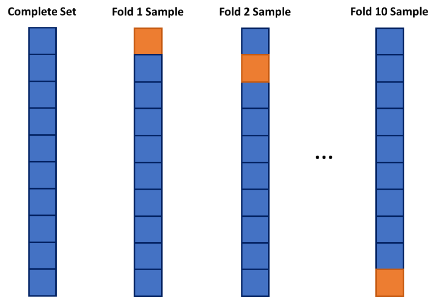

# Model Building and Scoring for Prediction


```{r include=F}
library(AmesHousing)
library(tidyverse)
library(car)
library(DescTools)
library(corrplot)
library(mosaic)
library(modelr)
library(plotly)
library(ggplot2)
library(Hmisc)
library(onehot)
library(jmuOutlier)
library(leaps)
library(glmnet)
library(nortest)
library(lmtest)
library(gmodels)
library(TSA)
library(carData)

ames <- make_ordinal_ames() 

library(reticulate)
#use_python("C:\\Users\\sjsimmo2\\AppData\\Local\\Programs\\Python/Python39\\python.exe")
use_python("C:\\ProgramData\\Anaconda3\\python.exe")

```


```{r  include=FALSE}
library(tidyverse)

set.seed(123)

ames <- ames %>% mutate(id = row_number())

train <- ames %>% sample_frac(0.7)

test <- anti_join(ames, train, by = 'id')


```


```{python,echo=F}
import pandas as pd
import numpy as np
from sklearn.preprocessing import OneHotEncoder
import seaborn as sns
import matplotlib.pyplot as plt
from numpy import random
import statsmodels.api as sma
import statsmodels as sm
import pylab as py
```


```{python,echo=F}
import scipy.stats as stats
import scipy as sp
import statsmodels.formula.api as smf
import sklearn
from sklearn.linear_model import Ridge
from sklearn.linear_model import Lasso
from sklearn.linear_model import ElasticNet
from sklearn.metrics import mean_squared_error
from plotnine import *
from sklearn.linear_model import LinearRegression
from sklearn.model_selection import train_test_split


ames_py = pd.read_csv('https://raw.githubusercontent.com/IAA-Faculty/statistical_foundations/refs/heads/master/Ames.csv')

ames_py["Sales"]=ames_py["Sale_Price"]/1000


train,test = train_test_split(ames_py,test_size=0.3,random_state=123)

```


In the preceding chapters, we have only scratched the surface of model building. Linear regression is a great initial approach to take to model building. In fact, in the realm of statistical models, linear regression (calculated by ordinary least squares) is the **best linear unbiased estimator**. The two key pieces to that previous statement are "best" and "unbiased." 

What does it mean to be **unbiased**? Each of the sample coefficients ($\hat{\beta}$'s) in the regression model are estimates of the true coefficients. Just like the statistics back in the EDA section, these sample coefficients have sampling distributions - specifically, normally distributed sampling distributions. The mean of the sampling distribution of $\hat{\beta}_j$ is the true (known) coefficient $\beta_j$. This means the coefficient is unbiased.


What does it mean to be **best**? *IF* the assumptions of ordinary least squares are met fully, then the sampling distributions of the coefficients in the model have the **minimum** variance of all unbiased estimators. 

These two things combined seem like what we want in a model - estimating what we want (unbiased) and doing it in a way that has the minimum amount of variation (best among the unbiased). Again, these rely on the assumptions of linear regression holding true. Another approach to regression would be to use **regularized regression** instead as a different approach to building the model.

This Chapter aims to answer the following questions:

* What is regularized regression? 

  + Penalties in Modeling
  + Ridge Regression
  + LASSO
  + Elastic Net

* How do you optimize the penalty term?
    
  + Overfitting
  + Cross-Validation (CV)
  + CV in Regularized Regression
    
* How do you compare different types of models?
    
  + Model Metric
  + Model Scoring
  + Test Dataset Comparison


## Regularized Regression


As the number of variables in a linear regression model increase, the chances of having a model that meets all of the assumptions starts to diminish. Multicollinearity can pose a large problem with bigger regression models. As previously discussed, the coefficients of a linear regression vary widely in the presence of multicollinearity. These variations lead to overfitting of a regression model. **Overfitting** occurs when a dataset predicts the training data it was built off of really well, but does not generalize to the test dataset or the population in general. More formally, these models have higher variance than desired. In those scenarios, moving out of the realm of unbiased estimates may provide a lower variance in the model, even though the model is no longer unbiased as described above. We wouldn't want to be too biased, but some small degree of bias might improve the model's fit overall.

Another potential problem for linear regression is when we have more variables than observations in our dataset. This is a common problem in the space of genetic modeling. In this scenario, the ordinary least squares approach leads to multiple solutions instead of just one. Unfortunately, most of these infinite solutions overfit the problem at hand anyway.

Regularized (or penalized or shrinkage) regression techniques potentially alleviate these problems. Regularized regression puts constraints on the estimated coefficients in our model and *shrink* these estimates to zero. This helps reduce the variation in the coefficients (improving the variance of the model), but at the cost of biasing the coefficients. The specific constraints that are put on the regression inform the three common approaches - **ridge regression**, **LASSO**, and **elastic nets**.

### Penalties in Models


In ordinary least squares linear regression, we minimize the sum of the squared residuals (or errors) . 


$$
min(\sum_{i=1}^n(y_i - \hat{y}_i)^2) = min(SSE)
$$

In regularized regression, however, we add a penalty term to the $SSE$ as follows:

$$
min(\sum_{i=1}^n(y_i - \hat{y}_i)^2 + Penalty) = min(SSE + Penalty)
$$

As mentioned above, the penalties we choose constrain the estimated coefficients in our model and shrink these estimates to zero. Different penalties have different effects on the estimated coefficients. Two common approaches to adding penalties are the ridge and LASSO approaches. The elastic net approach is a combination of these two. Let's explore each of these in further detail!

#### R code:

### Ridge Regression

Ridge regression adds what is commonly referred to as an "$L_2$" penalty:

$$
min(\sum_{i=1}^n(y_i - \hat{y}_i)^2 + \lambda \sum_{j=1}^p \hat{\beta}^2_j) = min(SSE + \lambda \sum_{j=1}^p \hat{\beta}^2_j)
$$

This penalty is controlled by the **tuning parameter** $\lambda$. If $\lambda = 0$, then we have typical OLS linear regression. However, as $\lambda \rightarrow \infty$, the coefficients in the model shrink to zero. This makes intuitive sense. Since the estimated coefficients, $\hat{\beta}_j$'s, are the only thing changing to minimize this equation, then as $\lambda \rightarrow \infty$, the equation is best minimized by forcing the coefficients to be smaller and smaller. We will see how to optimize this penalty term in a later section.

Let's build a regularized regression for our Ames dataset. To build a ridge regression we need separate data matrices for our predictors and our target variable. First, we isolate out the variables we are interested in using the ```select``` function. These functions cannot handle missing values in our dataset, so the last line of code using the ```mutate_if``` function which replaces missing values with the average of variable it is in. From there the ```model.matrix``` function will create any categorical dummy variables needed. We also isolate the target variable into its own vector.


```{r}
train_reg <- train %>% 
  dplyr::select(Sale_Price, 
         Lot_Area,
         Street,
         Bldg_Type,
         House_Style,
         Overall_Qual,
         Roof_Style,
         Central_Air,
         First_Flr_SF,
         Second_Flr_SF,
         Full_Bath,
         Half_Bath,
         Fireplaces,
         Garage_Area,
         Gr_Liv_Area, 
         TotRms_AbvGrd) %>%
  mutate_if(is.numeric, ~replace_na(.,mean(., na.rm = TRUE)))

train_x <- model.matrix(Sale_Price ~ ., data = train_reg)[, -1]
train_y <- train_reg$Sale_Price
```

We will want to do the same thing for the test dataset as well.

```{r}
test_reg <- test %>% 
  dplyr::select(Sale_Price, 
         Lot_Area,
         Street,
         Bldg_Type,
         House_Style,
         Overall_Qual,
         Roof_Style,
         Central_Air,
         First_Flr_SF,
         Second_Flr_SF,
         Full_Bath,
         Half_Bath,
         Fireplaces,
         Garage_Area,
         Gr_Liv_Area, 
         TotRms_AbvGrd) %>%
  mutate_if(is.numeric, ~replace_na(.,mean(., na.rm = TRUE)))

test_x <- model.matrix(Sale_Price ~ ., data = test_reg)[, -1]
test_y <- test_reg$Sale_Price
```


From there we use the ```glmnet``` function with the ```x = ``` option where we specify the predictor model matrix and the ```y = ``` option where we specify the target variable. The ```alpha = 0``` option specifies that a ridge regression will be used as defined in more detail below in the elastic net section. The ```plot``` function allows us to see the impact of the penalty on the coefficients in the model. 

```{r}
library(glmnet)

ames_ridge <- glmnet(x = train_x,  y = train_y,  alpha = 0)

plot(ames_ridge, xvar = "lambda")
```

The ```glmnet``` function automatically standardizes the variables before fitting the regression model. This is important so that all of the variables are on the same scale before adjustments are made to the estimated coefficients. Even with this standardization we can see the large coefficient values for some of the variables. The top of the plot lists how many variables are in the model at each value of penalty. This will never change for ridge regression, but does for LASSO. 

What $\lambda$ term is best? That will be discussed in the optimizing section below, but let's discuss other possible penalties first.

### LASSO
**Least absolute shrinkage and selection operator** (LASSO) regression adds what is commonly referred to as an "$L_1$" penalty:

$$
min(\sum_{i=1}^n(y_i - \hat{y}_i)^2 + \lambda \sum_{j=1}^p |\hat{\beta}_j|) = min(SSE + \lambda \sum_{j=1}^p |\hat{\beta}_j|)
$$

This penalty is controlled by the **tuning parameter** $\lambda$. If $\lambda = 0$, then we have typical OLS linear regression. However, as $\lambda \rightarrow \infty$, the coefficients in the model shrink to zero. This makes intuitive sense. Since the estimated coefficients, $\hat{\beta}_j$'s, are the only thing changing to minimize this equation, then as $\lambda \rightarrow \infty$, the equation is best minimized by forcing the coefficients to be smaller and smaller. We will see how to optimize this penalty term in a later section.

However, unlike ridge regression that has the coefficient estimates approach zero asymptotically, in LASSO regression the coefficients can actually equal zero. This may not be as intuitive when initially looking at the penalty terms themselves. It becomes easier to see when dealing with the solutions to the coefficient estimates. Without going into too much mathematical detail, this is done by taking the derivative of the minimization function (objective function) and setting it equal to zero. From there we can determine the optimal solution for the estimated coefficients. In OLS regression the estimates for the coefficients can be shown to equal the following (in matrix form):

$$
\hat{\beta} = (X^TX)^{-1}X^TY
$$

This changes in the presence of penalty terms. For ridge regression, the solution becomes the following:

$$
\hat{\beta} = (X^TX + \lambda I)^{-1}X^TY
$$

There is no value for $\lambda$ that can force the coefficients to be zero by itself. Therefore, unless the data makes the coefficient zero, the penalty term can only force the estimated coefficient to zero asymptotically as $\lambda \rightarrow \infty$. 

However, for LASSO, the solution becomes the following:

$$
\hat{\beta} = (X^TX)^{-1}(X^TY - \lambda I)
$$

Notice the distinct difference here. In this scenario, there is a possible penalty value ($\lambda = X^TY$) that will force the estimated coefficients to equal zero. There is some benefit to this. This makes LASSO also function as a variable selection criteria as well.

Let's build a regularized regression for our Ames dataset using the LASSO approach. To build a LASSO regression we need separate data matrices for our predictors and our target variable just like we did for ridge. From there we use the ```glmnet``` function with the ```x = ``` option where we specify the predictor model matrix and the ```y = ``` option where we specify the target variable. The ```alpha = 1``` option specifies that a LASSO regression will be used as defined in more detail below in the elastic net section. The ```plot``` function allows us to see the impact of the penalty on the coefficients in the model. 

```{r}
ames_lasso <- glmnet(x = train_x,  y = train_y,  alpha = 1)

plot(ames_lasso, xvar = "lambda")
```

The ```glmnet``` function automatically standardizes the variables before fitting the regression model. This is important so that all of the variables are on the same scale before adjustments are made to the estimated coefficients. Even with this standardization we can see the large coefficient values for some of the variables. The top of the plot lists how many variables are in the model at each value of penalty. Notice as the penalty increases, the number of variables decreases as variables are forced to zero. 

What $\lambda$ term is best? That will be discussed in the optimizing section below, but let's discuss the last possible penalty first - the combination of both ridge and LASSO.

### Elastic Net
Which approach is better, ridge or LASSO? Both have advantages and disadvantages. LASSO performs variable selection while ridge keeps all variables in the model. However, reducing the number of variables might impact minimum error. Also, if you have two correlated variables, which one LASSO chooses to zero out is relatively arbitrary to the context of the problem. 

Elastic nets were designed to take advantage of both penalty approaches. In elastic nets, we are using both penalties in the minimization:

$$
min(SSE + \lambda_1 \sum_{j=1}^p |\hat{\beta}_j| + \lambda_2 \sum_{j=1}^p \hat{\beta}^2_j) 
$$

In R, the ```glmnet``` function takes a slightly different approach to the elastic net implementation with the following:

$$
min(SSE + \lambda[ \alpha \sum_{j=1}^p |\hat{\beta}_j| + (1-\alpha) \sum_{j=1}^p \hat{\beta}^2_j]) 
$$

R still has one penalty $\lambda$, however, it includes the $\alpha$ parameter to balance between the two penalty terms. This is why in ```glmnet```, the ```alpha = 1``` option gives a LASSO regression and ```alpha = 0``` gives a ridge regression. Any value in between zero and one will provide an elastic net.

Let's build a regularized regression for our Ames dataset using the elastic net approach with an $\alpha = 0.5$. To build am elastic net we need separate data matrices for our predictors and our target variable just like we did for ridge and LASSO. From there we use the ```glmnet``` function with the ```x = ``` option where we specify the predictor model matrix and the ```y = ``` option where we specify the target variable. The ```alpha = 0.5``` option specifies that an elastic net will be used since it is between zero and one. The ```plot``` function allows us to see the impact of the penalty on the coefficients in the model. 

```{r}
ames_en <- glmnet(x = train_x,  y = train_y,  alpha = 0.5)

plot(ames_en, xvar = "lambda")
```

The ```glmnet``` function automatically standardizes the variables before fitting the regression model. This is important so that all of the variables are on the same scale before adjustments are made to the estimated coefficients. Even with this standardization we can see the large coefficient values for some of the variables. The top of the plot lists how many variables are in the model at each value of penalty. Notice as the penalty increases, the number of variables decreases as variables are forced to zero using the LASSO piece of the elastic net penalty. 

What $\lambda$ term is best? What is the proper balance between ridge and LASSO penalties when building an elastic net? That will be discussed in the following section.

#### Python Code

*Ridge Regression*

```{python}


import matplotlib.pyplot as plt
from sklearn.linear_model import Ridge

from sklearn.metrics import mean_squared_error
from sklearn.linear_model import Lasso
from sklearn.linear_model import ElasticNet

train = train[['Sale_Price', 'Lot_Area', 'Street', 'Bldg_Type',
               'House_Style', 'Overall_Qual', 'Roof_Style', 
               'Central_Air', 'First_Flr_SF', 'Second_Flr_SF', 
               'Full_Bath', 'Half_Bath', 'Fireplaces', 
               'Garage_Area', 'Gr_Liv_Area', 'TotRms_AbvGrd']]
               
#train = train.fillna(0,inplace=True)
               
test = test[['Sale_Price', 'Lot_Area', 'Street', 'Bldg_Type',
             'House_Style', 'Overall_Qual', 'Roof_Style', 
             'Central_Air', 'First_Flr_SF', 'Second_Flr_SF', 
             'Full_Bath', 'Half_Bath', 'Fireplaces', 
             'Garage_Area', 'Gr_Liv_Area', 'TotRms_AbvGrd']]

#test = test.fillna(0,inplace=True)
```


```{python}
train_dummy = pd.get_dummies(train, columns = ['Street', 'Bldg_Type', 'House_Style', 'Overall_Qual', 'Roof_Style', 'Central_Air'])

print(train_dummy)
```


```{python}
from sklearn.preprocessing import StandardScaler

y = train_dummy['Sale_Price']

X = train_dummy.loc[:, train_dummy.columns != 'Sale_Price']


numeric_cols = train_dummy.select_dtypes(include=['number']).columns
scaler = StandardScaler()
train_dummy[numeric_cols] = scaler.fit_transform(train_dummy[numeric_cols])
y = train_dummy['Sale_Price']

X = train_dummy.loc[:, train_dummy.columns != 'Sale_Price']

ames_ridge = Ridge(alpha = 1.0).fit(X, y)
ames_ridge.score(X, y)
coef_df = pd.DataFrame({'Feature': X.columns, 'Coefficient': ames_ridge.coef_})
print(coef_df)
```


```{python}
n_alphas = 200
alphas = np.logspace(0.1, 5, n_alphas)

coefs = []
for a in alphas:
    ridge = Ridge(alpha=a)
    ridge.fit(X, y)
    coefs.append(ridge.coef_)
    
ax = plt.gca()

ax.plot(alphas, coefs)
ax.set_xscale("log")
plt.xlabel("alpha")
plt.ylabel("weights")
plt.title("Ridge coefficients as a function of the regularization")
plt.axis("tight")
plt.show()
```


*LASSO Regression*

```{python}
ames_lasso = Lasso(alpha = 0.01, max_iter = 5000).fit(X, y)
r2 = ames_lasso.score(X, y)
print("R-squared:", r2)
```


```{python}
n_alphas = 100
alphas2 = np.logspace(-4,0, n_alphas)

coefs2 = []
for a in alphas2:
    lasso = Lasso(alpha = a, max_iter = 5000)
    lasso.fit(X, y)
    coefs2.append(lasso.coef_)

plt.cla()
ax2 = plt.gca()

ax2.plot(alphas2, coefs2)
ax2.set_xscale("log")
plt.xlabel("alpha")
plt.ylabel("weights")
plt.title("LASSO coefficients as a function of the regularization")
plt.axis("tight")
plt.show()
```


* Elastic Net*

```{python}
ames_en = ElasticNet(alpha = 0.01, l1_ratio=0.5).fit(X,y)
```


```{python}
alphas = np.logspace(-4, 1, 100)  
coefs = []

for alpha in alphas:
    en = ElasticNet(alpha=alpha, l1_ratio=0.5, max_iter=10000)
    en.fit(X, y)
    coefs.append(en.coef_)

coefs = np.array(coefs)

plt.figure(figsize=(8, 6))
for i in range(coefs.shape[1]):
    plt.plot(alphas, coefs[:, i], label=f'X{i}' if X.columns is None else X.columns[i])

plt.xscale('log')
plt.xlabel('alpha')
plt.ylabel('Coefficient value')
plt.title('Elastic Net Coefficients vs Alpha')
plt.axis('tight')
plt.grid(True)
plt.show()

```

## Optimizing Penalties

No matter the approach listed above, a penatly term $\lambda$ needs to be picked. However, we do not want to get caught overfitting our training data by minimizing the variance so much that it is not generalizable to the overall pattern and other similar data. Take the following plot:

```{r, echo=FALSE}
x <- seq(-5, 5, 0.1)
y <- x^3 - 25*x + 5 + rnorm(length(x), 0, 8)

df_cubic <- data.frame(x,y)

ggplot(df_cubic, aes(x = x, y = y)) +
  geom_point() +
  geom_smooth(method = lm, formula = y ~ poly(x, 3), se = FALSE, colour = "lightblue") +  
  geom_smooth(method = lm, formula = y ~ poly(x, 26), se = FALSE, colour = "red", linetype = "dashed") +  
  geom_smooth(method = lm, formula = y ~ poly(x, 2), se = FALSE, colour = "orange", linetype = "dotted") +  
  theme_classic()
```

The red line is overfitted to the dataset and picks up too much of the unimportant pattern. The orange dotted line is underfit as it does not pick up enough of the pattern. The light blue, solid line is fit well to the dataset as it picks up the general pattern while not overfitting to the dataset.

### Cross-Validation

**Cross-validation** is a common approach in modeling to prevent overfitting of data when you need to **tune** a parameter. The idea of cross-validation is to split the training data into multiple pieces, build the model on a majority of the pieces while evaluating it on the remaining piece. Then we do the same process again, but switch out which pieces the model is built and evaluated on.

A common cross-validation (CV) approach is the $k$-fold CV. In the $k$-fold CV approach, the model is built $k$ times. The data is initially split into $k$ equally sized pieces. Each time the model is built, it is built off of $k-1$ pieces of the data and evaluated on the last piece. This process is repeated until each piece is left out for evaluation. This is diagrammed below in Figure \@ref(fig:kCV). 

```{r label='kCV', fig.align='center', fig.cap = 'Example of a 10-fold Cross-Validation', echo=F, out.width="50%"}

```

### CV in Regularized Regression

In R, the ```cv.glmnet``` function will automatically implement a 10-fold CV (by default, but can be adjusted through options) to help evaluate and optimize the $\lambda$ values for our regularized regression models. 

Let's perform an example using the LASSO regression. The ```cv.glmnet``` function takes the same inputs as the ```glmnet``` function above. Again, we will use the ```plot``` function, but this time we get a different plot. 

#### R code:

```{r}
ames_lasso_cv <- cv.glmnet(x = train_x,  y = train_y,  alpha = 1)

plot(ames_lasso_cv)

ames_lasso_cv$lambda.min 
ames_lasso_cv$lambda.1se
```

The above plot shows the results from our cross-validation. Here the models are evaluated based on their **mean-squared error** (MSE). The MSE is defined as $\frac{1}{n} \sum_{i=1}^n (y_i - \hat{y}_i)^2$. The $\lambda$ value that minimizes the MSE is 49.69435 (with a $\log(\lambda)$ = 3.91). This is highlighted by the first, vertical dashed line. The second vertical dashed line is the largest $\lambda$ value that is one standard error above the minimum value. This value is especially useful in LASSO regressions. The largest $\lambda$ within one standard error would provide approximately the same MSE, but with a further reduction in the number of variables. Notice that to go from the first line to the second, the change in MSE is very small, but the reduction of variables is from 36 variables to around 12 variables. 

Let's look at the impact on the coefficients under this penalty using the ```glmnet``` function as before.

```{r}
plot(ames_lasso, xvar = "lambda")
abline(v = log(ames_lasso_cv$lambda.1se), col = "red", lty = "dashed")
abline(v = log(ames_lasso_cv$lambda.min), col = "black", lty = "dashed")
```

To investigate which variables are important at a $\lambda$ value, we can view the coefficients using the ```coef``` function. They are ranked here:

```{r, warning=FALSE}
coef(ames_lasso, s = c(ames_lasso_cv$lambda.min, ames_lasso_cv$lambda.1se))
```

The variable describing the overall quality of the home is the driving factor of this model as well as the other variables listed above.

A similar approach can be taken for CV with ridge regression using the same structure of code. That will not be covered here. Elastic nets are more complicated in that they have multiple parameters to optimize. For that approach, an optimization grid will need to be structured to evaluate different $\lambda$ values across different $\alpha$ values. A loop can be set up to run the ```cv.glmnet``` function across many different values of $\alpha$. That will not be covered in detail here. 

## Model Comparisons

Now we have multiple models built for our dataset. To help evaluate which model is better, we will use the test dataset as described in Chapter \@ref(slr). 

The models we have built are nothing but formulas. All we have to do is put the test dataset in the formula to predict/score the test data. We **do not** rerun the algorithm as the goal is **not** to fit the test dataset, but to just score it. We need to make sure that we have the same structure to the test dataset that we do with the training dataset. Any variable transformations, new variable creations, and missing value imputations done on the training dataset must be done on the test dataset in the same way.

### Model Metrics

Once the predicted values are obtained from each model we need to evaluate good these predictions are. There are many different metrics to evaluate models depending on what type of target variable that you have. Some common metrics for continuous target variables are the square root of the mean squared error (RMSE), the mean absolute error (MAE), and mean absolute percentage error (MAPE). 

The RMSE is evaluated as follows:

$$
RMSE = \sqrt {\frac{1}{n} \sum_{i=1}^n (y_i - \hat{y}_i)^2}
$$
The RMSE is an approximation of the standard deviation of the prediction errors of the model. The downside of the RMSE is a lack of interpretability.

The MAE is evaluated as follows:

$$
MAE = \frac{1}{n} \sum_{i=1}^n |y_i - \hat{y}_i|
$$
The MAE gives the average absolute difference between our predictions and the actual values. This is a symmetric measure with great interpretability. The main disadvantage of this metric is that it depends on the scale of the data. For comparing two models evaluated on the same data, this isn't important. However, when comparing across different datasets, this may not be as helpful. For example, in temperature predictions, having an MAE of five degrees for a model built on Honolulu, Hawaii weather might not be comparable to a model built on weather in Raleigh, North Carolina.

The MAPE is evaluated as follows:

$$
MAPE = 100 \times \frac{1}{n} \sum_{i=1}^n |\frac{y_i - \hat{y}_i}{y_i}|
$$
The MAPE gives the average absolute *percentage* difference between our predictions and the actual values. This metric is very interpretable and not dependent on the scale of the data. However, it is not symmetric like the MAE.

### Test Dataset Comparison

The final model we had from Chapter \@ref(diag) had the variables . From this model we can use the ```predict``` function with the ```newdata = ``` option to use score the ```test``` dataset. 

```{r}

ames_lm <- lm(Sale_Price ~ . , data = train_reg)
test$pred_lm <- predict(ames_lm, newdata = test)

head(test$pred_lm)
```

To get predictions from the regularized regression models, a $\lambda$ value must be selected. For the previous LASSO regression we will choose the largest $\lambda$ value within one standard error of the minimum $\lambda$ value to help reduce the number of variables. Again, we will use the ```predict``` function. The ```s = ``` option is where we input the $\lambda$ value. The ```newx = ``` option is where we specify the ```test``` dataset. 

```{r}
test_reg$pred_lasso <- predict(ames_lasso, s = ames_lasso_cv$lambda.1se, newx = test_x)

head(test_reg$pred_lasso)
```

Now we need to calculate the MAE and MAPE for each model for comparison.

```{r}
test %>%
  mutate(lm_APE = 100*abs((Sale_Price - pred_lm)/Sale_Price)) %>%
  dplyr::summarise(MAPE_lm = mean(lm_APE))

test_reg %>%
  mutate(lasso_APE = 100*abs((Sale_Price - pred_lasso)/Sale_Price)) %>%
  dplyr::summarise(MAPE_lasso = mean(lasso_APE))

```

From the above results, we see that the linear regression has a lower MAPE. 

Once we have scored models with the test dataset, we should **not** go back to try and rebuild any models. We will use the model with the lowest MAE or MAPE. This number is also the number that we report on how well our model performs. No metrics on the training dataset should be reported for the performance of the model.


#### Python Code

*CV in Regularized Regression*

```{python}
from sklearn.linear_model import LassoCV

ames_lasso2 = LassoCV(cv = 10, random_state = 0).fit(X, y)

ames_lasso2.alpha_
```


```{python}
import time
from sklearn.preprocessing import StandardScaler
from sklearn.linear_model import LassoLarsIC
from sklearn.pipeline import make_pipeline

start_time = time.time()
model = make_pipeline(StandardScaler(), LassoCV(cv = 10)).fit(X, y)
fit_time = time.time() - start_time
```


```{python}

lasso = model[-1]
plt.semilogx(lasso.alphas_, lasso.mse_path_, linestyle=":")
plt.plot(
    lasso.alphas_,
    lasso.mse_path_.mean(axis=-1),
    color="black",
    label="Average across the folds",
    linewidth=2,
)
plt.axvline(lasso.alpha_, linestyle="--", color="black", label="alpha: CV estimate")

plt.xlabel(r"$\alpha$")
plt.ylabel("Mean square error")
plt.legend()
_ = plt.title(
    f"Mean square error on each fold: coordinate descent (train time: {fit_time:.2f}s)"
)

plt.show()
```


```{python}
# Best alpha found by cross-validation
print("Optimal alpha:", lasso.alpha_)


```

```{python}
# Coefficients at optimal alpha
print("Coefficients:", lasso.coef_)


```

